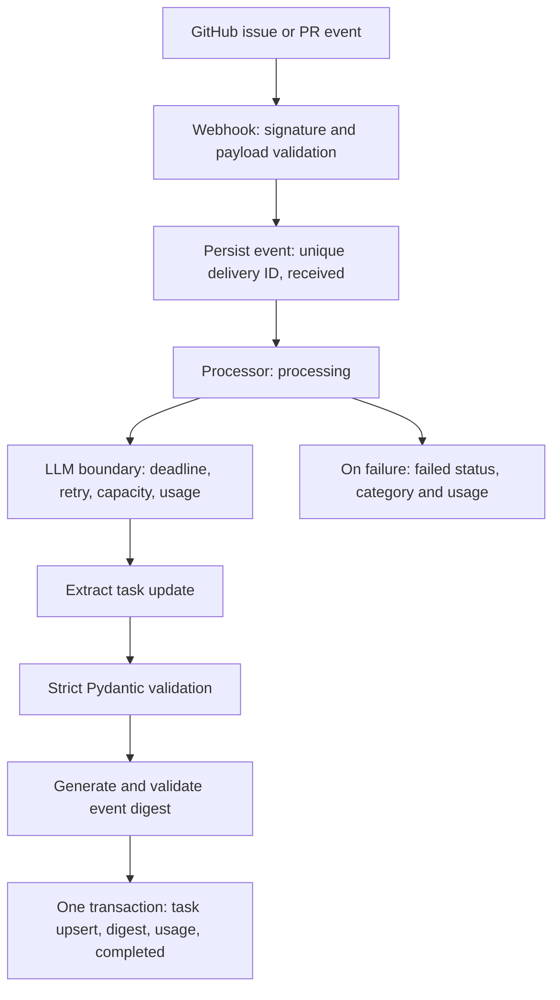

# Phase 1 reliability and observability

## Architecture



The webhook owns transport validation, `Processor` owns orchestration, `LLMBoundary`
owns provider policies, and `OpenAIProvider` alone owns SDK contracts. No queue,
background task, GitHub API write, RAG or distributed framework is introduced.
SQLite persists selected source payload fields before external work. Extra GitHub
fields and request headers are not stored. Task identity/state comes from GitHub;
LLM output supplies summary/category. Digests summarize individual events.

## Configuration

All environment variables have the `DOA_` prefix. `.env` is supported and ignored
by git. `.env.example` contains the complete configuration. Defaults:

| Setting (without prefix) | Default | Behavior |
| --- | --- | --- |
| WEBHOOK_SECRET / API_TOKEN | Required | Separate signature secret and digest read token |
| OPENAI_API_KEY | Required for real provider | Adapter credential |
| MODEL | gpt-4.1-mini | Explicitly override for your account; no live availability claim |
| DATABASE_URL | sqlite+aiosqlite:///./developer_ops.db | SQLite only in Phase 1 |
| ATTEMPT_TIMEOUT_SECONDS | 15 | Cancels one dispatched attempt |
| PROCESSING_DEADLINE_SECONDS | 45 | Shared deadline across processing and both LLM operations |
| MAX_ATTEMPTS | 3 | Per extraction/digest, including first attempt |
| RETRY_BASE_SECONDS / RETRY_CAP_SECONDS | 0.5 / 8 | Full-jitter exponential backoff |
| RETRY_BUDGET_SECONDS | 30 | Total per-operation budget including waits/calls/backoff |
| MAX_CONCURRENCY | 4 | Simultaneous provider calls per process |
| MAX_WAITERS | 16 | Maximum queued capacity waiters per process |
| CAPACITY_WAIT_SECONDS | 2 | Bound on acquiring provider capacity |
| REQUESTS_PER_WINDOW / RATE_WINDOW_SECONDS | 120 / 60 | Sliding-window dispatched requests |
| MAX_WEBHOOK_BYTES | 262144 | Reject larger request bodies with 413 |
| PRICING_MODEL / PRICING_VERSION | Unknown | Exact returned model and pricing provenance/version |
| INPUT_USD_PER_MILLION | Unknown | Ordinary input rate |
| CACHED_INPUT_USD_PER_MILLION | Unknown | Cached input rate |
| OUTPUT_USD_PER_MILLION | Unknown | Output rate |

Run a **single application process** with server admission control:

```sh
.venv/bin/uvicorn developer_ops.app:create_app --factory --host 127.0.0.1 --workers 1 --limit-concurrency 32
```

Limits are shared within that process only. No distributed budget is claimed.
The request window counts every dispatched retry. Local rate/capacity failures
are not retried internally. Capacity is released before backoff. The output cap
is 1,500 tokens per request. Input payload size is bounded, but there is no exact
input-token reservation budget: tokenizer/model-specific reservation is deferred.

## Retry and failure semantics

Retry only categorized timeouts, connections, HTTP 429, 500, 502, 503 and 504.
Never retry authentication, authorization, deterministic invalid requests or output
validation. Delay is `max(uniform(0, min(cap, base * 2**(attempt-1))), Retry-After)`.
Retry-After accepts seconds or an HTTP date. Budgets interrupt excessive waits;
SDK internal retries are disabled. Provider exceptions do not expose raw messages.

Both complete outputs pass strict schemas (including nonblank text, bounded lengths,
known category and no extra fields) before any task/digest write. One transaction
contains the conditional task upsert, digest, usage and completion. An older or
equal source timestamp cannot overwrite a newer task; its historical digest is
still recorded. Equal timestamps keep the first committed task version.

A unique delivery ID provides database-enforced deduplication, including concurrent
requests. Completed duplicates return HTTP 200; nonterminal or failed duplicates
return HTTP 503 without reprocessing. Reused IDs with changed selected payload
return 409. Invalid signatures return 401; invalid/unsupported input returns 422.
Failure categories include `timeout`, `deadline`, `retry_deadline`, `connection`,
`rate_limit`, `provider_http`, `authentication`, `authorization`, `capacity`,
`local_rate_limit`, `invalid_output`, `database`, `cancelled`, and `internal`.

A failed digest cannot leave a partial task change or a valid-looking digest.
Failures are persisted when the DB is available. A database outage can prevent
failure recording; it remains an unsuccessful response, not a fabricated success.
If a completion commit loses its acknowledgment, failure handling re-reads durable
state and preserves an already completed event. Session cleanup runs even when
commit raises. This does not replace hard-kill recovery testing.
The processing deadline begins after durable receipt; request upload and failure
recording are outside that deadline. SQLite lock waits are bounded to five seconds.

## Logs and usage

The `developer_ops` logger emits JSON to stderr, with timestamp, request_id,
event_id, stage, duration_ms, model, attempt, outcome and error_category. Request
IDs are server-generated, returned in `x-request-id`, and isolated using ContextVar.
Event IDs are validated delivery IDs; they are untrusted until HMAC validation.
`llm.usage` adds dispatched status, operation, tokens, cached tokens, estimated USD,
and pricing version. Retry logs include delay_seconds. Attempt duration includes capacity wait;
provider_latency_ms measures dispatched work separately. Validation and transaction
stages are logged explicitly. No body, prompt, generated
summary, authorization header, key or exception text is logged by the application.

`Event.usage` preserves per-attempt records and event totals across extraction,
digest and retries. Dispatched attempts with unavailable usage keep totals unknown;
`known_*` fields are explicitly partial subtotals, not actual totals. Rejected
capacity attempts are not provider spend. An empty dispatched set has known zero
provider usage. Cost requires configured pricing for the exact returned model;
missing cached-token details/rates keep estimates unknown where relevant. These
are estimates, not billing reconciliation, and hard crashes can lose local usage.
The event-to-digest primary key lets consumers attribute digest cost from the same
record; per-operation attempt records separate extraction and digest costs.

## Verification and remaining limits

- `baseline.json` and `milestone-results.json`: 30 alternating signed issue/PR
  events, fake provider, temporary file-backed SQLite, no external network.
- `failure-injection.md`: failure matrix and test evidence.
- `streaming.md`: simulated experiment; no production streaming consumer.
- `scripts/measure.py`: reproducible local overhead measurement and trace samples.

No real model quality, provider latency or actual dollar cost has been measured.
Provider model/schema support and account configuration need a credentialed smoke
test. Tests exercise the SDK against a mock HTTP transport.

Inline work can exceed webhook clients' response deadlines. Duplicates are safe,
but automatic replay, hard-kill recovery and stale received/processing recovery
are deferred to Phase 3. There is no operator replay API. Persisted source content
may be sensitive: protect the local DB and define retention before deployment.
Digest reads are authenticated but are a minimal bounded list, not a complete UI.

This is a fresh database schema, not a migration system. Intermediate development
commits are not schema-compatible; preserve/export any development DB before
switching versions. Schema migrations, retention, metrics backend, distributed
tracing, load testing, deployment and cloud secrets management remain later work.
